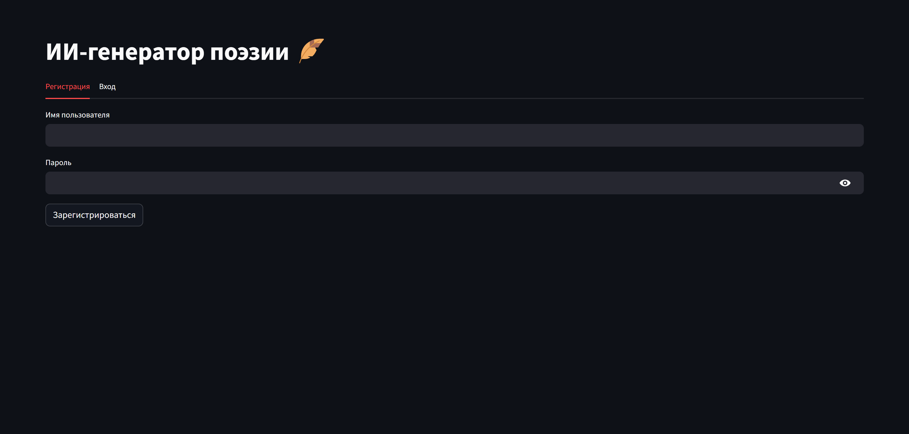
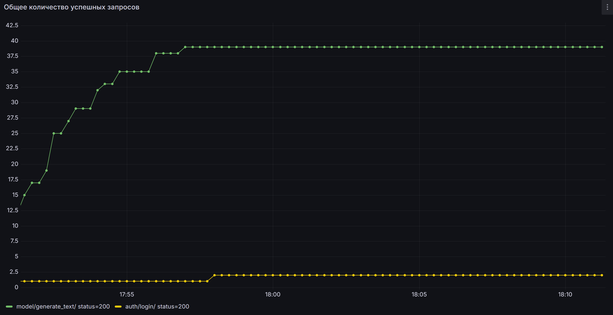

# 🪶 Проект "ИИ-генератор поэзии"

## ℹ️ Информация о проекте

Сервис для генерации поэзии в стиле романа в стихах "Евгений Онегин" с помощью русскоязычных генеративных моделей на базе GPT-2. В качестве базовой модели используется `rugpt3small_based_on_gpt2`. В проекте используется микросервисная архитектура.

## 🔑 Ключевые возможности

- Авторизация через JWT-токены 🔒
- Микросервисы для отделения клиентской части от моделей 🛠️
- Асинхронное взаимодействие с SQLite через aiosqlite 🗄️✨
- Интегрированная система мониторинга: Prometheus + Grafana 📊

## 📱 UI

## ⚙️ Сервисы

- **web-service 🌐**

  - API для аутентификации и маршрутизации запросов
  - Асинхронная база данных для хранения данных пользователей
- **model-service 🧠**

  - Получает сообщения из очереди, затем запускает генерацию текста с помощью выбранной модели
- **frontend 🖼️**

  - Streamlit UI, подключается к `http://web-service:8000`
- **rabbitmq** 🐇

  - Очередь сообщений для безопасного обмена между сервисами
- **prometheus** & **grafana** 📈

  - Сбор и визуализация метрик по работе сервисов

## 🔎 Мониторинг

Метрики мониторинга собираются с помощью Grafana + Prometheus

## 🚀 Запуск сервиса

> 1. `git clone https://github.com/khrstln/AITH-ML-Python.git`
> 2. `cd AITH-ML-Python && docker-compose up --build`
>
